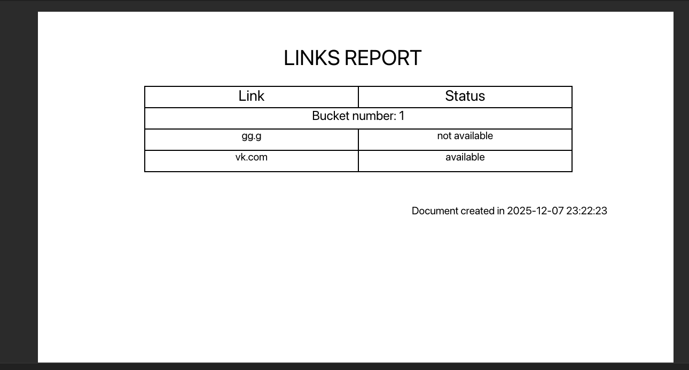
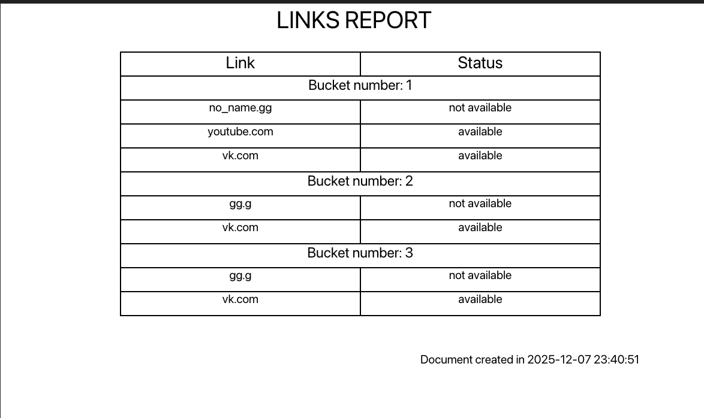
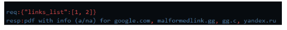

# 🔗 Links Checker - REST API Service

**REST API сервис для проверки доступности веб-ссылок с генерацией PDF отчетов**   

[Быстрый старт](#-быстрый-старт) • [Тестирование](#запуск-тестов) • [Документация по API](#работа-с-api) • [Архитектура](#архитектура-и-внутренне-устройство) 

## 🚀 Быстрый старт

### 📋 **Требования:**
- Git
- Go 1.24.5
- Make (опционально)

### 🔧 **Установка и запуск:**

#### **Шаг 1: Клонирование проекта**
```bash
git clone https://github.com/Piccadilly98/08.12.2025.git
cd 08.12.2025
git switch develop
```     
#### **Шаг 2: Запуск сервера:**
```bash
make start
```
Или без make
```bash
go run cmd/main/main.go
```

#### **Шаг 3: Увидеть логирование в консоли на подобие такого:**
```bash
2025/12/07 20:31:50 server start in: localhost:8080
2025/12/07 20:31:50 server signal worker starting
2025/12/07 20:31:50 Server work in PID: 13473
2025/12/07 20:31:50 To shut down the server, run 'kill 13473'
```

### Свои параметры сервера до запуска:
#### **Другой адрес или порт:**   
1. Заходим в cmd/main/main.go
2. Видим следующие строки:  
```go
server := server.MakeServer(10)
pid := server.Start("localhost:8080")
```
3. Меняем параметр метода Start для объекта server
* в случае неправильного порта или адресса вызовется паника с текстом ошибки  

   
#### **Настройка производительности: MakeServer(maxGoroutines)**

Числовой аргумент в функции `MakeServer` пакета `server` определяет  
**максимальное количество одновременно выполняемых проверок ссылок(пингов)**.  
**По сути это:** ограничитель количества параллельных горутин для пинга ссылок.      
**Для чего?**  
*   ✅ Защита от DDoS самого себя при больших запросах  
*   ✅ Настройка производительности под ваше железо  
*   ✅ Ограничение нагрузки на сетевые запросы     


**Пример:**
```go
server := server.MakeServer(50) //создаём с лимитом 50 одновременно проверяемых ссылок
```
[Подробнее](#LinkChecker)

#### **🎉Поздравляю! Сервер запущен и успешно работает**   
   
   
### 🛑**Остановка сервера**
### **На сервере реализован Graceful Shutdown который отвечает за состояния сервера, а именно:**
* ***Штатная работа***
* ***Полная остановка сервера***
* ***Пауза в работе - сервер продолжает слушать порт, но всем запросам отдаётся код 503***     
  
    

#### **Для перевода сервера в режим паузы и обратно:**
1. **Мы нажимаем Ctrl+C и видим подобный лог в консоли:**
```bash
^C2025/12/07 21:08:23 Server stop status: true
```
##### Теперь наш сервер не принимает новые запросы и ждёт старта
2. **Для старта так же нажимаем Ctrl+C и снова в консоли:**
```bash
^C2025/12/07 21:11:39 Server stop status: false
```
##### Теперь наш сервер снова принимает новые запросы!

#### **Полная остановка сервера:**
1. **При запуске у нас в консоли были логи:**
```bash
2025/12/07 20:31:50 server start in: localhost:8080
2025/12/07 20:31:50 server signal worker starting
2025/12/07 20:31:50 Server work in PID: 13473                 #номер pid(процесса)
2025/12/07 20:31:50 To shut down the server, run 'kill 13473' #команда для остановки
```
2. **Копируем команду или вручную в новом окне терминала:**
```bash
kill 13473 #ваш номер pid будет другой
```
3. **В консоли видим 2 варианта:**
* 1 вариант
```bash
2025/12/07 21:35:05 Server stop status: true
2025/12/07 21:35:05 server stop
```
* 2 вариант
```bash
2025/12/07 21:44:07 Server stop status: true
2025/12/07 21:44:10 Lost requests: 1  #количество незавершённых запросов
2025/12/07 21:44:10 server stop
```
**Первый вариант вывода обозначает что сервер был немедленно завершён**  
  

**Второй же вариант обозначает что сервер завершил работу во время запросов:**  
**Перед завершением наш сервер подождал 3 секунды и активный или активные запросы так и не завершились**   

### **Запуск тестов:**
 В корне проекта выполнить:
```bash
make test
```
Или без make
```bash
go test -v tests/*
```   

## **Работа с API**
В API предлставлено 3 энд-поинта:
* POST /registration - для регистрации нового списка ссылок
* GET /dock          - получение пдф файла с содержимым по агрументам тела запроса
* GET /dock/query    - получение пдф файла с содержимым по query параметрам

### **/registration**
#### Работает по методу POST и принимает тело в форматах:  

Первый вариант как в ТЗ:
```json
{
    "links":["youtube.com", "vk.com"]       //в массиве может быть как один так и множество элементов
}
```  
Второй вариант для удобства:
```json
{
    "link":"youtube.com"
}
```
Ну и комбинация вариантов:
```json
{
    "links":["youtube.com", "vk.com"],
    "link":"ok.ru"
}
```   

#### Формат данных:  
Энд поинт принимает как ссылки в виде:
* Без протоколов: `"youtube.com"`, `"vk.com"`  
* С протоколом: `https://github.com/`, `https://docs.google.com/`  
* Тело не может быть пустым

#### Формат ответа:  
**Успешный запрос:** 
```json
{
    "links": {                                  //мапа ссылок и их состояния
        "no_name.gg": "not available",
        "vk.com": "available",
        "youtube.com": "available"
    },  
    "num_bucket": 1                             // внутренний номер бакета
}
```
`HTTP CODE: 201`  

**Ошибка:**
```json
{
    "status": "error",
    "error": "invalid body",                     // текст ошибки(может быть детальнее)
    "date": "2025-12-07 22:42:26.783581 +0400 +04 m=+136.756442543"
}
```
`HTTP CODE: в зависимости от ошибки(400, 503)`      

**О внутреннем устройстве хендлера описано в разделе Архитектура и внутренне устройство**


### **/dock**
### Работает по методу GET и принимает тело запроса в форматах:
Первый вариант как в ТЗ:
```json
{
    "links_list":[1,2,3,4]                 //номера бакетов, значения которых мы получим
}                                          //в итоговом пдф
```

Второй вариант для удобства:
```json
{
    "link_list":1
}
```

Третий вариант, комбинация:
```json
{
    "link_list":1,
    "links_list":[1,2,3,4]
}
```

#### Формат данных:  
Энд поинт принимает числа которые:  
1. `Являются целыми`
2. `>= 0`
3. `Тело не может быть пустым`

#### Формат ответа:  
**Успешный запрос:**    
`Header: Content-Type" = "application/pdf"`  
Получаем PDF документ вида:   


`HTTP CODE: 200`   

**Ошибка:**
```json
{
    "status": "error",
    "error": "invalid id - 5",                  //текст ошибки
    "date": "2025-12-07 23:29:02.103414 +0400 +04 m=+11.412309001"
}
```   
`HTTP CODE: в зависимости от ошибки(400, 503)`      

**О внутреннем устройстве хендлера описано в разделе Архитектура и внутренне устройство**  

### **/dock/query**
### Работает по методу GET и принимает номера бакетов в query параметрах:    
Первый вариант:
```
/dock/query?bucketID=1
``` 
Или несколько номеров
```
/dock/query?bucketID=1,2,5
```   

Второй вариант - диапазон:
```
/dock/query?bucketID=3-4
```
Или:
```
/dock/query?bucketID=3-3
```


#### Формат данных:  
**Энд поинт принимает числа которые:** 
1. `Являются целыми`
2. `>= 0`
3. `Тело не может быть пустым`  

**Если это диапазон то так же:**
1. `Первое число не меньше второго`
2. `Не более 1 символа -`   

#### Формат ответа:  
**Успешный запрос:**    
`Header: Content-Type" = "application/pdf"`  
Получаем PDF документ вида:   


`HTTP CODE: 200`   

**Ошибка:**
```json
{
    "status": "error",
    "error": "invalid range",                   //текст ошибки
    "date": "2025-12-07 23:43:00.365322 +0400 +04 m=+849.732287751"
}
```   
`HTTP CODE: в зависимости от ошибки(400, 503)`     

**О внутреннем устройстве хендлера описано в разделе Архитектура и внутренне устройство** 

## **Архитектура и внутренне устройство**

### 📁 Структура проекта
```bash
├── 📂 cmd/
│   └── 📂 main/
│       └── 📄 main.go                  # Точка входа
│
├── 📂 internal/                        # Основные пакеты
│   │
│   ├── 📂 document_worker/             # Генерация PDF
│   │   └── 📄 documentWorker.go
│   │
│   ├── 📂 DTO/                         # JSON структуры(DTO)
│   │   ├── 📄 errorDTO.go  
│   │   ├── 📄 getInfoBucketDTO.go
│   │   ├── 📄 GetBucketsRequest.go
│   │   └── 📄 registrationLinksDTO.go
│   │
│   ├── 📂 handlers/                    # HTTP хендлеры для энд поинтов
│   │   ├── 📄 commonFunctions.go       # Общие функции для хендлеров
│   │   ├── 📄 getBucketInfoHandler.go  # Хендлер для отдачи документа с использованием тела запроса
│   │   ├── 📄 getBucketInfoQuery.go    # Хендлер для получения документа по query параметру
│   │   └── 📄 registrationHandler.go   # Хендлер для создания бакета ссылок
│   │
│   ├── 📂 linkChecker/                 # Проверка ссылок
│   │   └── 📄 linkChecker.go
│   │
│   ├── 📂 middleware/                  # Middleware
│   │   └── 📄 middleware.go
│   │
│   │
│   ├── 📂 processing_os_signal/        # Graceful Shutdown
│   │   └── 📄 signalWorker.go
│   │
│   ├── 📂 server/                      # Создание, остановка и работа сервера
│   │   └── 📄 server.go
│   │
│   └── 📂 storage/                     # Хранение данных
│       └── 📄 storage.go
│
├── 📂 materials/                       # Доп материалы
│   ├── 📂 fonts/                       # Шрифты для пдф
│   └── 📂 screenshots/                 # Скрины для readme
│
├── 📂 tests/                               # Тесты
│   ├── 📄 unit_graceful_shutdown_stop_test.go
│   ├── 📄 unit_handler_dock_query_test.go
│   ├── 📄 unit_handler_dock_test.go
│   └── 📄 unit_handler_registration_test.go
│                                 
├── 📄 go.mod
├── 📄 go.sum                          
├── 📄 Makefile              
└── 📄 README.md                       
```    

### 📟 О хендлерах
### Внутреннее устройство:
#### **/registration:**
* Хендлер принимает тело запроса, валидирует данные и передаёт все полученные ссылки  
в linkChecker  
* В свою очередь linkChecker `параллельно*` пингует ссылки по следующему алгоритму:  
  1. Если у ссылки нету протокола в начале он добавляет сначала `http`
  2. Отправляет запрос с `таймаутом 5 секунд` по ссылке методом `HEAD`
  3. Если получен любой код кроме 5xx то завершаем обработку, ссылка получает статус `avaliable`
        1. Если нет, то проверяем ошибку
        2. Если ошибка таймаута то мы дальше не пингуем эту ссылку, статус `not avaliable`
        3. Если ошибки нету, то пытаемся получить данные методом `GET`
        4. Если получен любой код кроме 5xx то завершаем обработку, ссылка получает статус `avaliable`
        5. Ошибка таймаута - статус `not avaliable`, дальше не пингуем
        6. Если другая ошибка и ссылка была получена без протокола то повторяем цепочку с `http`  
* Затем данные полученные из LinkProcessor регистрируются в storage
* В конечном итоге хендлер запрашивает у storage данные по номеру бакета и отдаёт в ответе  

[Про Параллельность](#linkchecker)

#### **/dock:**  
* Хендлер принимает тело с данными о номерах бакетов по которым нужно получить данные
* Тело валидируется и отправляется в storage где мы берём данные всех бакетов из списка
* Хендлер отправляет эти данные в document_worker
* В ответ получаем данные в виде среза байт который можно сразу отдавать в ответ http 
 

**Хендлер был реализован в согласии с ТЗ:**  
  

**Обычно тела GET запросов не используются, так как это противоречит REST API**  
**поэтому я реализовал 2 разных энд поинта: `/dock` с телом запроса и `/dock/query`**  
**который уже соответсвует принципам REST API**

#### **/dock/query:**  
* Идеоматичный по REST API хендлер   
* Хендлер извлекает query параметр `bucketID` из URL
* Поддерживает три формата:
  - Одиночный ID: `?bucketID=1`
  - Список ID: `?bucketID=1,2,3`
  - Диапазон: `?bucketID=1-3`
* Парсит и валидирует данные, затем запрашивает storage
* Полученные данные передаются в document_worker для генерации PDF


### LinkChecker
**Внутреннее устройство**
**LinkChecker в коде выглядит как:**
```go
type LinkProcessor struct {
    client *http.Client // Один клиент на весь процессор
	wg sync.WaitGroup   // WaitGroup для синхронизации горутин при параллельной обработке
	ch chan struct{}    // Канал который используется для ограничения одновременных обработок
	mu sync.RWMutex     // Mutex используется для конкурентного сбора данных со всех обработчиков
}
```
* При создании сервера в функцию server.MakeServer() мы передаём число которое в свою очередь передаётся в создание нового LinkProcessor, в коде выглядит так:
```go
const (
	defaultMaxGoroutine = 10
)

func MakeLinkProcessor(maxGoroutine int) *LinkProcessor {
	if maxGoroutine <= 0 {                                 
		maxGoroutine = defaultMaxGoroutine              //если вдруг значение не валидное ставим дефолт
	}
	lp := &LinkProcessor{
		ch: make(chan struct{}, maxGoroutine),          //создаём канал-семафор, который будет ограничивать
		client: &http.Client{                           //максимальное колличество горутин
			Timeout: 5 * time.Second,
			CheckRedirect: func(req *http.Request, via []*http.Request) error {
				return http.ErrUseLastResponse
			},
		},
	}
	return lp
}
```
* LinkProcessor переиспользует http соединения за счёт общего клиента
* Указатель на объект `LinkProcessor` содержится в типе RegistrationHandler, соответственно из хендлера мы можем использовать методы `LinkProcessor`
* Далее при вызове получении и валидации ссылок мы передаём их в метод объекта `LinkProcessor.LinkChecker(links []string)` и запускаем обработку
* Обработка и параллелизм выглядит так:
```go
func (lp *LinkProcessor) LinkChecker(links []string) map[string]string {
	res := make(map[string]string)
	for _, l := range links {
		// код обработки сокращён
        // ...
		lp.wg.Add(1)                              // добавляем счётчик в wait group
		lp.ch <- struct{}{}                       // как только горутина готова к работе она кладёт в канал
		go func(link string) {                    // если в канале нет места, то это блокирующая операция
			defer lp.wg.Done()
			defer func() {                         // при завершении обработки горутина достаёт свой "токен" и
				<-lp.ch                            // освобождает место для других горутин
			}()
			status, _, _ := Processinglink(link, lp.client)
			lp.mu.Lock()
			res[link] = status
			lp.mu.Unlock()
		}(l)
	}
	lp.wg.Wait()                                     // ждём все горутины и завершаем обработку
	return res
}
```
* Таким образом я реализовал систему которая ограничивает нагрузку на железо, защищает от падения по памяти, в проде известная как `сeмофор`

### Graceful shutdown
**Внутреннее устройство**
**Greceful shutdown в коде выглядит как:**
```go
type WorkerOSSignal struct {
	isStoped     atomic.Bool     //отвечает за статус стоп
	signals      chan os.Signal  //канал который ловит сигналы ОС(SIGINT и SIGTERM)
	exitChan     chan struct{}   //канал который слушает главная горутина в main
	countRequest atomic.Int64    //счетчик активных запросов, работает middleware
	isOff        atomic.Bool     //отключен ли сервер
}
```
* Воркер работает в отдельной горутине и слушает канал `signals`
* Как только ос отправляет программе `SIGINT(Ctrl+C)` или `SIGTERM(kill)`:
    1. Воркер ставит переменную isStoped в true
    2. Следующие запросы обрабатываться не будут, текущие будут обработаны
    3. Если это `SIGINT` то воркер продолжает слушать канал и ждать запросы
    4. Если это `SIGTERM`, то:
        1. Горутина проверяет есть ли активные запросы: нет-отправляем значение в канал `exitChan`
        2. Если есть то ждём 3 секунды и проверяем снова: нет-отправляем значение в канал `exitChan`
        3. Если есть то количество потеряных запросов принтуется и отправляем в `exitChan`
* Главная горутина заблокирована в main при чтении `exitChan`
* Как только в `exitChan` погружается значение, main горутина разблокируется и завершает программу  


### Middleware
**Внутреннее устройство**
**Middleware представляет из себя тип http.Handler который позволяет делать пред и пост обработку запросов**
* Используется он с помощью:
```go
server.R.Use(midddleware.MidddlewareCounterRequests(server.signalWorker))
//где server - экземпляр структуры Server
//R - объект chi.Router{}
//R.Use - позволяет нам использовать любой http.Handler на всей маршрутизации
```
* В начале запроса middleware проверяет ту самую переменную из WorkerOSSignal.isStoped:
    1. Если она равна true то middleware не пускате запрос и отдаёт такое тело ответа с кодом 503:
    ````json
    {
        "status": "error",
        "error": "server stoped, please repeat you request later",
        "date": "2025-12-08 01:38:45.763743 +0400 +04 m=+7795.251185001"
    }
    ````
    2. Если переменная равна false, значит запрос можно пропускать
* Затем мы инкрементируем счётчик запросов из WorkerOSSignal.countRequest
* Идём в хендлер
* После обработки декриментируем счётчик  
* Для наглядности схемка:
```
HTTP Request → Проверка isStoped → 503 если true → Инкремент countRequest → 
→ Handler обработка → Декремент countRequest → HTTP Response
```

### Storage
**Внутреннее устройство**
**Storage в коде выглядит как структура:**
```go
type Storage struct {
	counter atomic.Int64                    // счётчик id бакетов
	links   map[int64]map[string]string     // сама мапа в который все значения 
	mu      sync.RWMutex                    // мьютекс для конкуретного доступа
}
```
* Объект `Storage` создаётся один раз при старте сервера и прокидывается в хендлеры, которые используют методы `Storage`
* В качесте примитива синхронизации был выбран `RWMutex` так как он позволяет конкурентно читать нескольким горутинам(запросам)
* В мапе хранится:
```go
links := {
    10: {                                //id бакета
        "youtube.com":"avaliable",       // ссылкка : статус
        "gg.g":"not avaliable"           
    },
}
```
        Такая структура была выбрана для того что бы соответствовать ответу по ТЗ и легко переносить из DTO в само хранилище
* У `Storage` предусмотрены свои методы которые позволяют конкурентно взаимодействовать с полями хранилища
* Так же соответствуя принципам Инкапсуляции поля `Storage` были сделаны не импортируемыми


---

## Контакты

**Спасибо за просмотр!**

- **GitHub:** [@Piccadilly98](https://github.com/Piccadilly98)
- **Резюме на HH:** [hh.ru](https://samara.hh.ru/resume/875f5df3ff0fbfea5f0039ed1f39506e574431)
- **Telegram:** [@sanchello991](https://t.me/sanchello991)
---